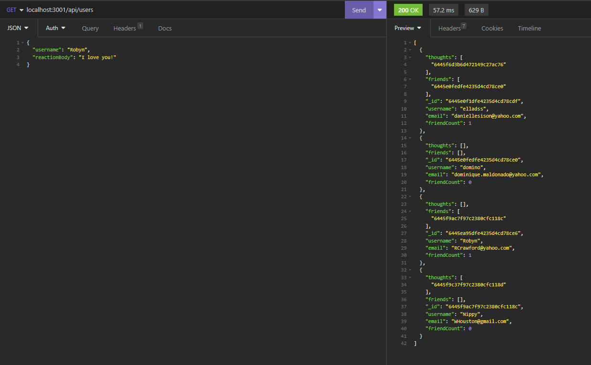
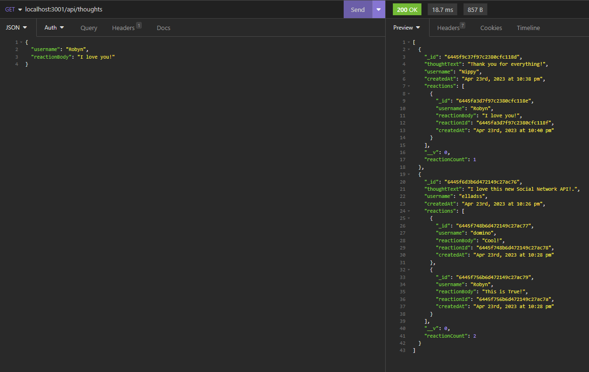

# Nux Socialis V

## Walkthrough Video: https://drive.google.com/file/d/1USxtqWhbEHp91kboBKEXao2u74XOORek/view

## Description

Social Network API utilizing NoSQL(MongoDB).

## Installations

Please install the following through your terminal:

```
npm i
```

## Usage

<ul>
<li>
Run the server by typing the following command in your terminal within the server.js folder:

```
npm run start
```
</li>
<li> As demonstrated in the video the GET, POST, PUT, and DELETE routes are functional, and listed as the following:
<ul>
<li>USER: </li>
    <ol>
    <li> You should be able to get all USERS by using the GET route (/api/users) and by individual IDs (/api/users/:userId). </li>
    <li> You should be able to add USERS by using the POST route (/api/users). </li>
    <li> You should be able to update USERS by using the PUT route (/api/users/:userId). </li>
    <li> You should be able to remove USERS by using the DELETE route (/api/users/:userId). </li>
    </ol> 
<li>THOUGHTS: </li>
    <ol>
    <li> You should be able to get all THOUGHTS by using the GET route (/api/thoughts) and by individual IDs (/api/thoughts/:userId). </li>
    <li> You should be able to add THOUGHTS by using the POST route (/api/thoughts). </li>
    <li> You should be able to update THOUGHTS by using the PUT route (/api/thoughts/:thoughtId). </li>
    <li> You should be able to remove THOUGHTS by using the DELETE route (/api/thoughts/:thoughtId). </li>
    </ol> 
<li>FRIENDS: </li>
    <ol>
    <li> You should be able to add FRIENDS by using the POST route (/api/users/:userId/friends/:friendId).</li>
    <li> You should be able to remove FRIENDS by using the DELETE route (/api/users/:userId/friends/:friendId).</li>
    </ol> 
<li>REACTIONS: </li>
    <ol>
    <li> You should be able to add REACTIONS by using the POST route (/api/thoughts/:thoughtId/reactions).</li>
    <li> You should be able to remove REACTIONS by using the DELETE route (/api/thoughts/:thoughtId/reactions/:reactionId).</li>
    </ol> 
</li>
</ul>
</ul>

## Screenshot

Below is a page preview of the app:

<ul>
<li> USERS Preview </li>



<li> THOUGHTS Preview </li>



## Credits

The following programs / guides were used to create this project:

<ul>
<li>Node.js - https://nodejs.org/en/</li>
<li>Express - https://www.npmjs.com/package/express</li>
<li>Mongoose - https://www.npmjs.com/package/mongoose</li>
</ul>

Thank you to the instructors and TA's that helped with this project.

## License

N/A
